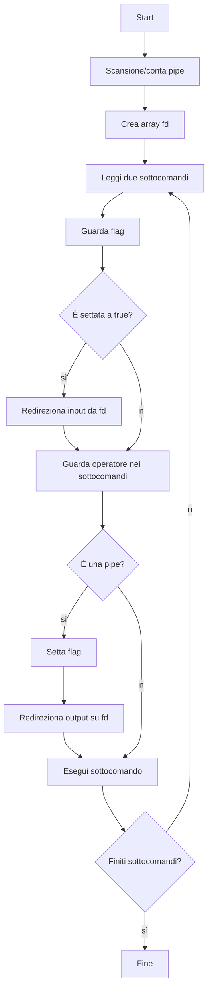

# Piping flowchart

```mermaid
graph TD;
    Start-->Pipe[Scansione/conta pipe]
    Pipe-->FD[Crea array fd]
    FD-->Loop[Leggi due sottocomandi]
    Loop-->GuardaFlag[Guarda flag]
    GuardaFlag-->CondFlag{È settata a true?}
    CondFlag--sì-->RedirectIn[Redireziona input da fd]
    RedirectIn-->Op[Guarda operatore nei sottocomandi]
    CondFlag--no-->Op
    Op-->IsPipe{È una pipe?}
    IsPipe--sì-->Flag[Setta flag]
    Flag-->Redirect[Redireziona output su fd]
    Redirect-->Execute
    IsPipe--no-->Execute[Esegui sottocomando]
    Execute-->Cond{Finiti sottocomandi?}
    Cond--no-->Loop
    Cond--sì-->Fine
```