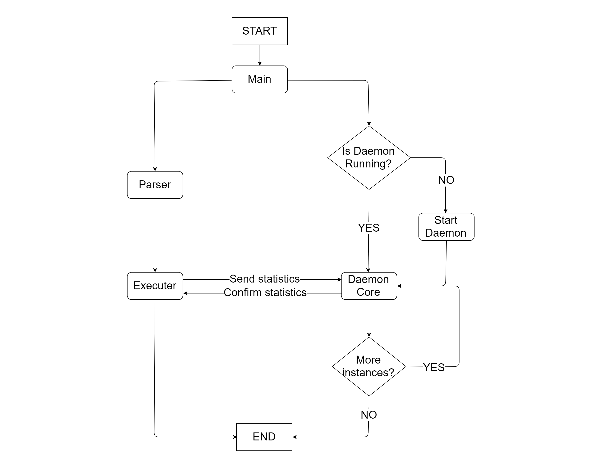

# Workflow



# Struttura

## Esecutore

Scopone lo SCRIPT in sottocomandi opportunamente eseguiti tramite processi figli.  
Sono utilizzati thread per l'attesa di processi concorrenti.

## Operatori

L'esecuzione dei sottocomandi rispetta eventuali operatori di:

 - controllo: `&&`, `||`, `;`, `|`
 - redirezione: `>`,`>>`, `<`

#### Built-in commands

Implentazione interna del comado `cd PATH`

## Logger Daemon

Riceve le statistiche salvandole con l'opportuna formattazione.  
Viene lanciato e interrotto a seconda delle istanze attive dell'esecutore.  

## Segnali e gestione degli errori

Signal handler e wrapper delle system call per la corretta chiusura del demone in caso di segnalazione esterna.  
Exit status conforme agli standard.

# Tested on

- Arch
- Debian 9
- Ubuntu 14.04

# Esempi

_Posizionarsi in `.bin/`_

## Comandi semplici

Copia 10G di zeri su `/dev/null`

```bash
./xlogger "dd if=/dev/zero of=/dev/null count=10 bs=1G"
```

## Comandi interattivi

```bash
./xlogger "nano /tmp/test.txt"
```

## Operatori logici

- Tentativo di creare un file senza avere i permessi sufficienti
- Semplice `ls`
```bash
./xlogger "touch /test && date"
./xlogger "touch /test || date"
```

## Redirezione

```bash
./xlogger "ls > out.txt"

./xlogger "ls > out.txt; ls > out.txt; sort -r < out.txt >> out.txt"
```

## Comandi interni

```bash
./xlogger "cd ..; pwd && ls"
```


## Gestione path custom

**Output dei comandi su "/tmp/output", errori su "/tmp/error" e statistiche su "/tmp/stats"**
- Semplice `ls`
- Tentativo di creare un file senza avere i permessi sufficienti

```bash
./xlogger "ls; touch /test" -x "/tmp/output" -X "/tmp/error" -p "/tmp/stats"
```

## Statistiche su file CSV

```bash
./xlogger "ls -alF | grep xlogger; echo hello" --format=csv -p="/tmp/stats.csv"
```

## Istanze multiple

```bash
./xlogger "sleep 8" & ./xlogger "sleep 12" & ./xlogger "sleep 10" &

htop
```

## Multithread e Concorrenza pipe

```bash
./xlogger "ls; echo hello; sleep 100 | sleep 150 | sleep 50"

htop
```

```bash
time ./xlogger "sleep 1; sleep 3 | sleep 2"
```

## Gestioni segnali

```bash
./xlogger "sleep 100"

ctrl-c
echo $?

./xlogger "sleep 100"

ctrl-z
fg
close TTY
```
